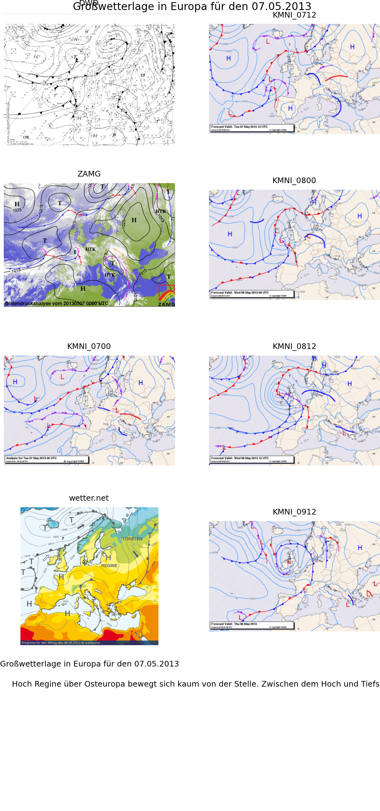

weather
=======

This code
- is inspired by [this article][1] on "small data"
- checks the webpages of
    - DWD
    - ZAMG
    - KMNI ('AL' = analysis, 'PL' = prediction)
    - wetter.net
  for information regarding the "Grosswetterlage" in central / NE europe
* save the individual images if you want
* create an overview map containing all the relevant images;
    * left column: analysis (current time)
    * right column: prediction (future)
    * these overview maps can be stored
    * these stored files are interesting to analyze in their sequence over time (compared with the predictions)
* this might be useful for preparing skiing or sailing trips, or just general curiosity

ToDo
----

* plot the text of the prognosis in reasonable way (bottom left)
* make the headings prettier 
    * date and hour formatting
    * left: analysis; right: prognosis (only KMNI)

Example Output
--------------

[1]: http://m.guardian.co.uk/news/datablog/2013/apr/25/forget-big-data-small-data-revolution